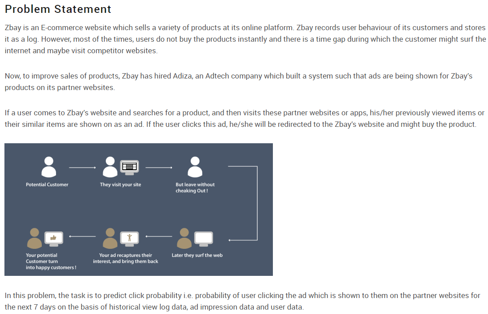
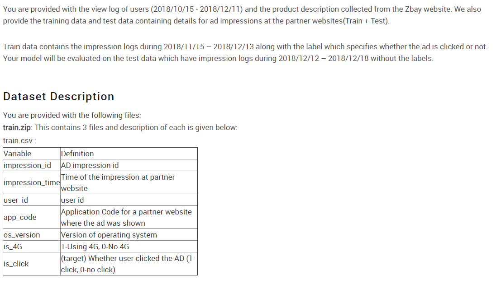

# AV WNS Analytics Wizard 2019

# Collaboration With
* [Chetan Ambi](https://github.com/chetanambi)

# Note
* **Solution - Part 1.ipynb**
This solution produces 3 csv files
*AV_WNS_forkkv2_lgb_folds.csv*
*AV_WNS_forkkv2_cb_folds.csv*
*AV_WNS_forkkv2_CBstack_folds.csv* (final - produces by stacking above 2 csv files)

* **Solution - Part 2.ipynb**
This solution produces 1 csv file
*sub2_10fold_lgbm.csv*

* **Solution - Part 3.ipynb**
This is the final solution stacks *AV_WNS_forkkv2_CBstack_folds.csv & sub2_10fold_lgbm.csv*
and produces final submission csv file

* **Final submission** *ensemble_chetan_rajat_final.csv*

# Leaderboard (Nodus Tollens)

* **[Public LB](https://datahack.analyticsvidhya.com/contest/wns-analytics-wizard-2019/lb)** : **16th/836 Rank**
* **[Private LB](https://datahack.analyticsvidhya.com/contest/wns-analytics-wizard-2019/pvt_lb)** : **16th/836 Rank**

(6.5K Participants)
